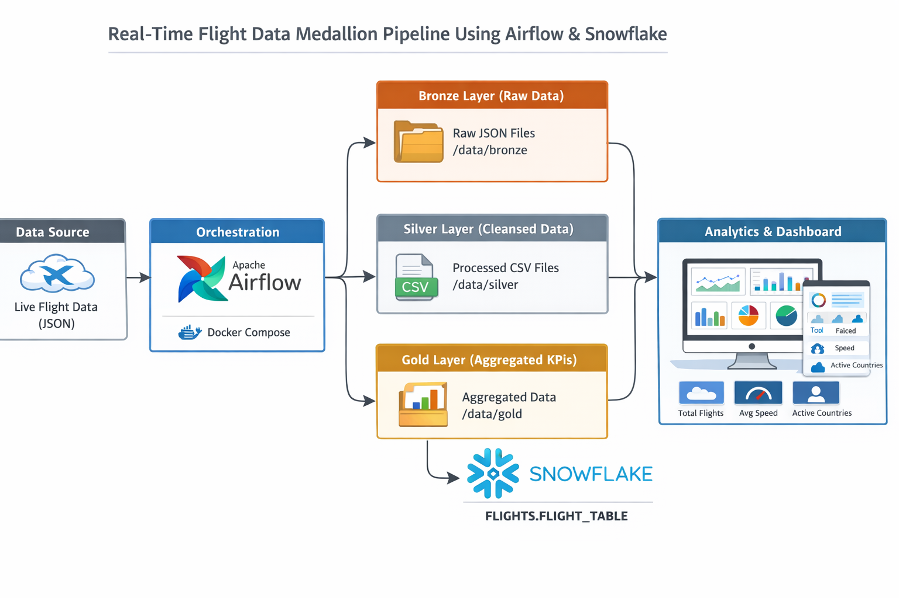
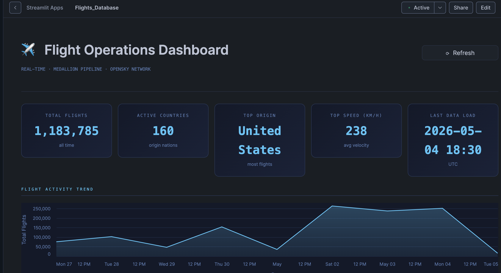
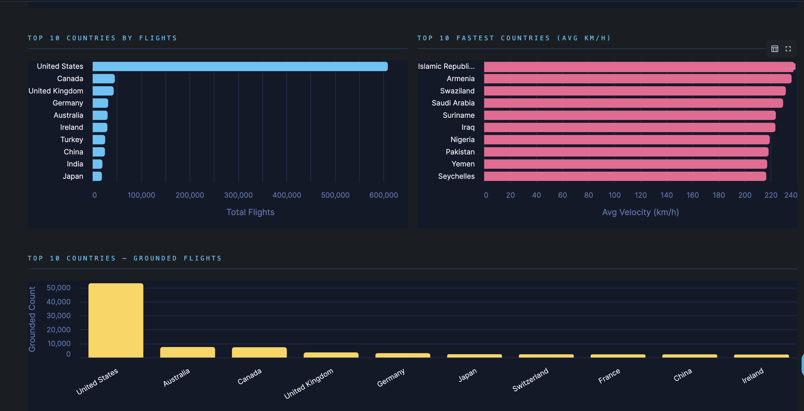
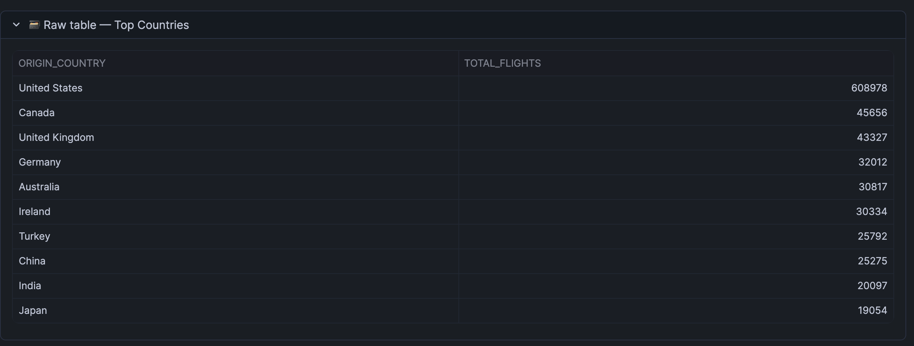
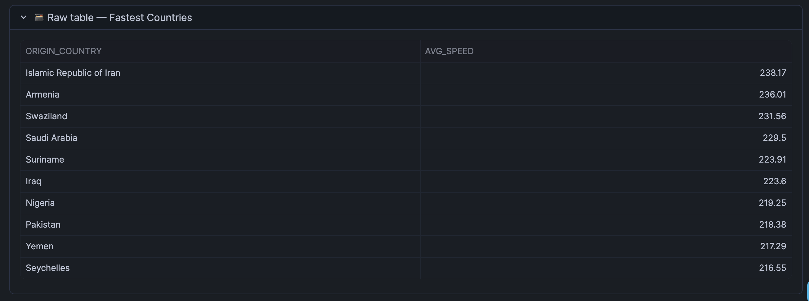

# Flight Data Medallion Pipeline — Airflow + Snowflake + Native Streamlit

A cloud-native data engineering pipeline that ingests real-time flight data, processes it using Medallion Architecture (Bronze → Silver → Gold), stores it in Snowflake, and visualizes insights using a **Streamlit app running directly inside Snowflake**.

---

## Project Overview

This project demonstrates a **modern data stack used in industry**:

* Real-time ingestion from OpenSky API
* Medallion Architecture (Bronze → Silver → Gold)
* Workflow orchestration using Apache Airflow
* Cloud data warehouse using Snowflake
* Native analytics using **Streamlit in Snowflake**

 Built as a **production-style analytics system**

---

## Key Features

* ✅ Automated ETL pipeline (Airflow DAG)
* ✅ Structured data layers (Bronze → Silver → Gold)
* ✅ Incremental loading using Snowflake MERGE
* ✅ Real-time flight analytics
* ✅ **Streamlit app hosted inside Snowflake**
* ✅ No external dashboard deployment

---

## Architecture



---

## Pipeline Flow

```text
OpenSky API
   ↓
Bronze (Raw JSON)
   ↓
Silver (Cleaned CSV)
   ↓
Gold (Aggregated Metrics)
   ↓
Snowflake (Warehouse)
   ↓
Streamlit App (inside Snowflake)
```

---

## Snowflake Native Streamlit Dashboard

The dashboard is built using **Streamlit inside Snowflake**, which allows:

* Direct querying of warehouse tables
* Real-time analytics without data movement
* Fully cloud-native execution

---

### Dashboard Preview



---

### Flight Analytics



---

### Insights



---



---

## 📈 Example Insights

* Top countries by flight volume
* Fastest countries by average velocity
* Grounded aircraft distribution
* Flight trends over time

---

## DAG Details

* **DAG ID:** `flights_ops_medallion_pipe`
* **Schedule:** Every 30 minutes
* **Tool:** Apache Airflow

### Pipeline Tasks:

1. **Bronze Layer**

   * Ingests raw flight data (JSON)

2. **Silver Layer**

   * Cleans and structures data

3. **Gold Layer**

   * Aggregates key metrics

4. **Snowflake Load**

   * Uses MERGE for incremental updates

---

## Snowflake Integration

* Data stored in:

```sql
FLIGHTS.FLIGHTS_SCHEMA.FLIGHT_TABLE
```

* Supports:

  * Incremental updates (MERGE)
  * Scalable analytics queries

---

## How to View the Dashboard

1. Open Snowflake UI
2. Navigate to:

```
Projects → Streamlit Apps
```

3. Open:

```
Flights_Database Dashboard
```

The Streamlit app runs **inside Snowflake (no local execution required)**

---

## 📂 Project Structure

```text
.
├── assets/
│   ├── dashboard1.png
│   ├── dashboard2.png
│   ├── dashboard3.png
│   └── dashboard4.png
│
├── dags/
│   └── flight-pipeline.py
│
├── scripts/
│   ├── bronze_layer.py
│   ├── silver_layer.py
│   ├── gold_layer.py
│   └── snowflake_implement.py
│
├── data/
├── logs/
├── plugins/
├── docker-compose.yml
├── requirements.txt
└── .env
```

---

## Tech Stack

| Category      | Tools                        |
| ------------- | ---------------------------- |
| Language      | Python                       |
| Orchestration | Apache Airflow               |
| Processing    | Pandas                       |
| Warehouse     | Snowflake                    |
| Visualization | Streamlit (Snowflake Native) |
| API           | OpenSky Network              |
| Deployment    | Docker                       |

---

## Running the Pipeline

```bash
docker-compose up
```

Airflow UI:

```
http://localhost:8080
```

---

## Why This Project Stands Out

* End-to-end data engineering pipeline
* Medallion architecture implementation
* Cloud-native analytics (Snowflake + Streamlit)
* Real-time data processing
* Production-style system design

Mirrors **real-world data platforms used in companies**


---
